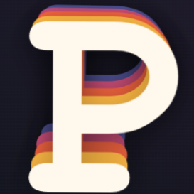

#  ParaText (Parallax effect for text)

**ParaText** est une application web interactive qui permet de générer et de personnaliser de superbes effets de typographie cinétique en parallaxe multicouche. En déplaçant simplement le curseur sur l'écran, les différentes couches de texte s'animent et se séparent en temps réel selon plusieurs algorithmes mathématiques de mouvement.

Le projet arbore une interface moderne au design **Glassmorphism**, entièrement responsive et soignée.

---

## ✨ Fonctionnalités

* **Effet Parallaxe Dynamique :** Mouvement fluide des couches basé sur les coordonnées en temps réel de la souris (`--mouse-x` et `--mouse-y`) ou sur l'orientation de l'appareil (`deviceorientation`) pour les appareils mobiles.
* **6 Modes Cinétiques Prédéfinis + Mode Personnalisé :**
    * *Séparé (Standard)* : Éloignement progressif et linéaire des couches.
    * *Groupé (Suivi)* : Les couches se suivent de près.
    * *Distant (Explosion)* : Amplification exponentielle de l'écartement.
    * *Inversé (Miroir)* : Les couches alternent leur direction pour un effet miroir saisissant.
    * *Chaos (Désordonné)* : Facteurs de mouvement pseudo-aléatoires.
    * *Onde Élastique* : Mouvement basé sur une fonction sinusoïdale.
    * *⚙️ Personnalisé...* : Prenez le contrôle total via 4 curseurs indépendants (*Éloignement, Fluidité, Élasticité, Facteur Temporel*).
* **Gestion des Palettes de Couleurs :** 8 presets vibrants (*Sunset Glow, Cyberpunk, Neon Acid, Mystic Forest, Ice & Fire, Deep Ocean, Volcano, Vintage Pastel*) ainsi qu'un mode **Dégradé Fluide personnalisable**.
* **Contrôle de la Densité :** Ajustement dynamique du nombre de couches de texte (de 1 à 10) en temps réel.
* **Traduction Intégrale (i18n) :** Bascule instantanée entre l'Anglais et le Français avec une animation d'onde de choc fluide sur la typographie.
* **Interface Glassmorphism :** Panneaux de réglages transparents et floutés avec filtre de rétroéclairage radial.

---

## 🛠️ Technologies Utilisées

* **HTML5** : Structure sémantique et éléments de contrôle (`<input type="range">`, `<select>`).
* **CSS3 (Modern UI)** :
    * Variables CSS (Custom Properties) pour l'injection des données cinétiques.
    * `backdrop-filter` pour les effets de flou de verre (Glassmorphism).
    * `will-change` et fonctions de transition `cubic-bezier` pour des performances d'animation à 60 FPS.
    * Transformations 3D (`perspective`, `rotate`, `translate`).
* **Vanilla JavaScript (ES6+)** : Manipulation dynamique du DOM, calculs d'interpolation de couleurs (Hexadécimal) et gestion des états d'affichage.

---

## 🚀 Installation Locale

Pour lancer le projet sur votre machine en quelques secondes :

1. **Clonez le dépôt :**
   ```bash
   git clone https://github.com/Pyronixus/ParaText.git
   ```
   SSH
   ```bash
   git@github.com:Pyronixus/ParaText.git
   ```
   Github CLI
   ```bash
   gh repo clone Pyronixus/ParaText
